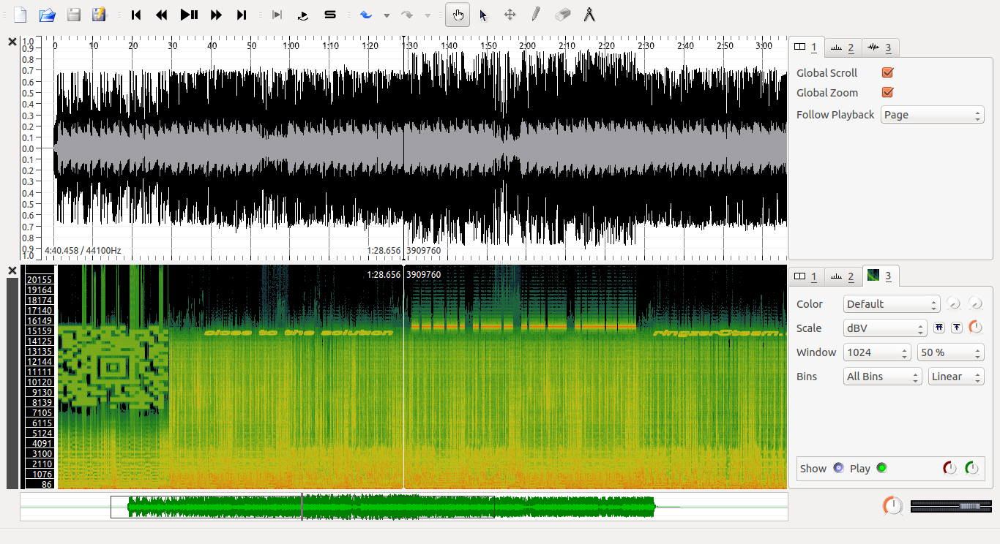
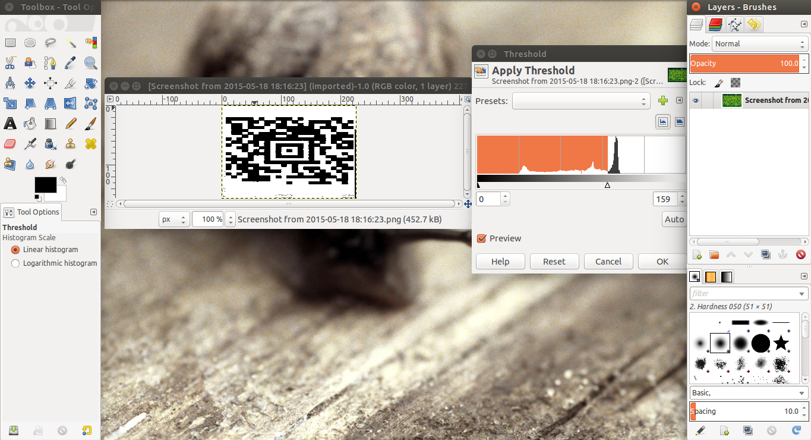
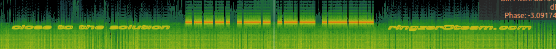

# [SigID Level 1](http://ringzer0team.com/challenges/136)
After downloading the .ogg file, you need to open it with an audio editor/visualizer application.
Here we use [Sonic Visualizer](http://www.sonicvisualiser.org/download.html).

Ubuntu / Debian Linux:

`sudo apt-get install sonic-visualiser`

After you downloaded and installed it, open Sonic Visualizer from application pane. type `sonic-visualizer` in a command line alternatively.

Open the .ogg file in the application. Then click on Layer > Add Spectrogram menu (Press G on keyboard).

This is what you'll see then:

Just scan the QR Code on the left side and there it is! The FLAG!

**the flag is : mathsRulesTheUniverse**

* Hint: You may want to change the green-noisy QR Code to a black and white one and so your barcode reader can read it then. For this purpose just take a screenshot from the QR Code (Hold Shift, Press PrintScreen on keyboard if you have an Ubuntu and draw a rectangle covering the QR Code.), open it in [Gimp Image Editor](http://www.gimp.org/downloads/) and click on Colors > Threshold. Like this:

Adjust the threshold bar till it becomes a good-looking black on white QR Code. Then scan it with your Barcode Scanner. An android Barcode Scanner could be found [Here](https://play.google.com/store/apps/details?id=com.google.zxing.client.android&hl=en) and an online one [Here](http://zxing.org/w/decode.jspx).
* The QR Code type is Aztec.

## Hint for SigID Level 2
As you see in the first picture in this writeup, there is more than just a QR Code. Let's look at it carefully:

It says: **Close to the solution ...... ringzer0team.com**

The central part of the image is a hint. Look with more care:

It is dots and dashes. Yes! It is **Morse code**!
Just Decode it to get the hint for SigID level 2. There is a morse code decoder [Here](http://morsecode.scphillips.com/translator.html).

It says: **HINT FOR SIG ID LEVEL 2 USE GNU RADIO GRC USE DEFAULT BLOCKS NO ADDITIONAL CODE REQUIRED**

Next -> [SigID Level 2 Writeup](https://github.com/alirezaomidi/ctf/tree/master/ringzer0team/steganography/sig-id-level-2)

By the way, have you seen [Interstellar](http://www.imdb.com/title/tt0816692/) Movie?! This level just recalled me this movie!

Enjoy!