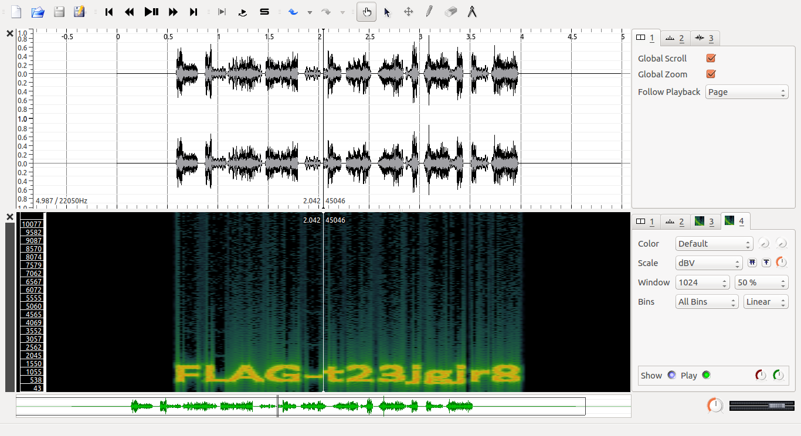

# [TAPS Team Have Recorded Some Ghost Sound](http://ringzer0team.com/challenges/22)

For this problem, we need an audio visualizer. Here We use [Sonic Visualizer](http://www.sonicvisualiser.org/download.html).

Ubuntu / Debian: `sudo apt-get install sonic-visualizer`

Now:

```
$ sonic-visualiser 15d087d9cc86e82b87d0e5ce2cef8583.wav
```

From the **Layer** menu, choose **Add Spectrogram** (Press **G** on keyboard) and there is the flag:



Enjoy!