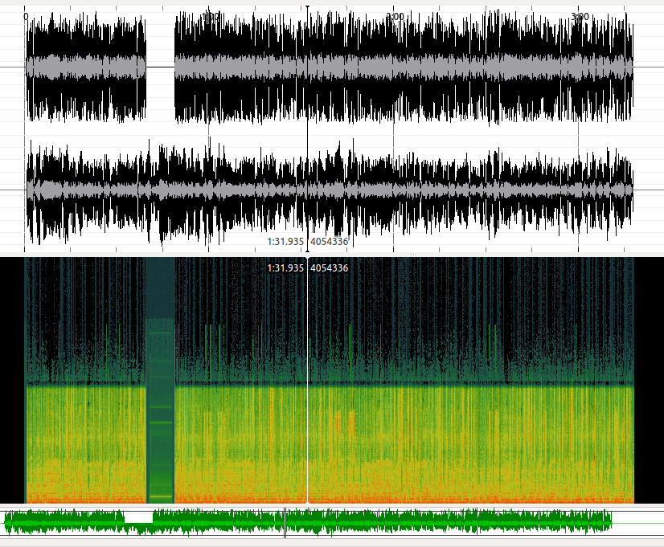
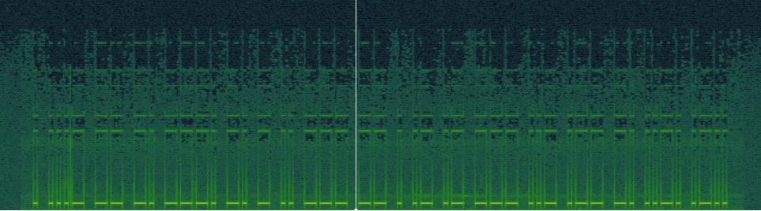
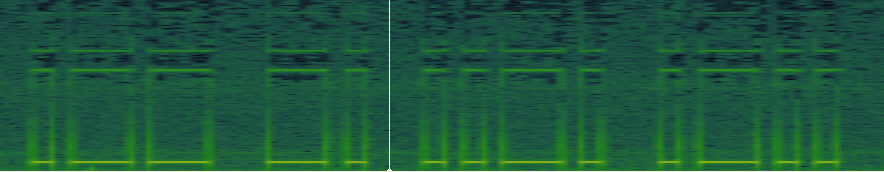

# Your Old Friend Orloge Simard

First download the gift of our friend!

Use [Sonic Visualizer](http://www.sonicvisualiser.org/download.html):
```
$ sonic-visualiser 135553e7dfe65469fcf69c167fd1979a.mp3
```

From **Layer** menu, choose **Add Spectrogram** then **Channel 1**.



As you can see, there is something in the gap, in the first quarter of channel 1. Zoom to see it better:



I like seeing **Morse Codes** in steganography problems! But this code is a bit different! You have to read it from right to left. like this:



`..-. .-.. .- --.` which means **FLAG**.

So the **flag** is: **FLAGDONNEMOITAJAMBE**

Enjoy!